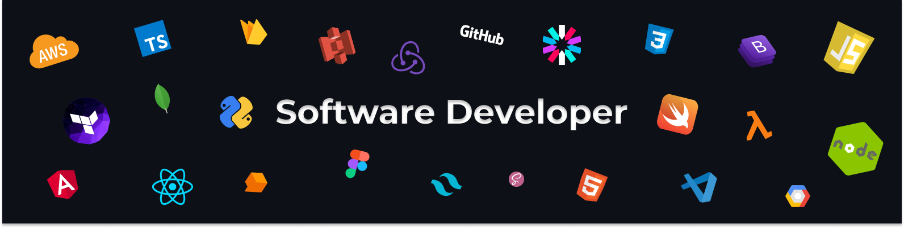

  
  ### About Me
  

As a Software developer with 5+ years of experience, I am skilled in using AWS, Serverless, Node.js, React JS and many Javascript based technologies to build scalable, high-performance web applications. In my current role, I have successfully designed and implemented several serverless architectures, resulting in reduced costs and improved reliability for our clients. I am excited about the potential of these technologies and am always looking for opportunities to learn and grow as a developer.

 ### Recent Blog Posts

<a href="https://medium.com/towards-aws/save-big-on-serverless-5-ways-to-reduce-your-aws-lambda-costs-45675d32b9ed" target="_blank">Save Big on Serverless: 5 Ways to Reduce Your AWS Lambda Costs</a>
 
<a href="https://medium.com/towards-aws/beginners-guide-to-running-docker-containers-on-aws-lambda-part-1-f7e0a402b168" target="_blank">Beginner’s Guide to Running Docker Containers on AWS Lambda — Part 1</a>
 
<a href="https://medium.com/towards-aws/beginners-guide-to-running-docker-containers-on-aws-lambda-part-2-f866fe1aa16c" target="_blank">Beginner’s Guide to Running Docker Containers on AWS Lambda — Part 2</a>
 
<a href="https://medium.com/@caspergeek/create-routing-app-coverage-file-for-apple-app-store-submission-684e03d22a73" target="_blank">Create Routing App Coverage file for apple app store submission</a>
 

### Find Me On

  
     )      

 
 ### Tech Stack

 

